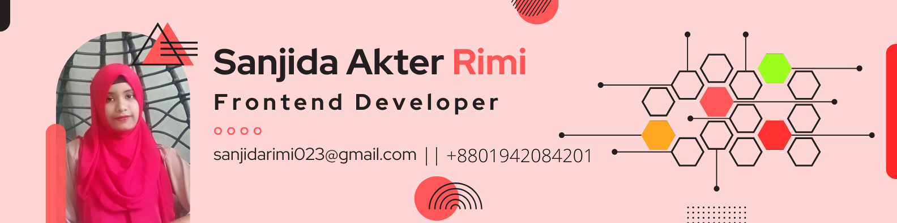

---

###  **About Me:**

Assalamualaikum and welcome!

I'm Sanjida Akter Rimi,  a dedicated and enthusiastic **Frontend-focused MERN Stack Developer** based in **Kurigram, Bangladesh**. I specialize in building fast, clean, and scalable web applications using modern tools like `React.js`, `Next.js`,`Node.js`, `Express.js`, `MongoDB`, and `Firebase`.

With a strong foundation in **HTML**, **CSS**, and responsive UI frameworks like **Tailwind CSS**, **Shadcn UI**, and **Bootstrap**, I bring user interfaces to life that are both visually appealing and functionally robust. I’m passionate about creating seamless user experiences that are accessible, modern, and performance-driven.

On the backend, I focus on developing secure, maintainable APIs and full-featured systems using **Express.js** and **JWT**. I’ve worked with **MongoDB** and know how to structure data models for real-world use cases. I also enjoy integrating tools like Firebase for authentication and hosting, **Zod** for validation, and TanStack Query for efficient data handling.

##### 🔧 What i use :

- Frontend: React.js, Next.js, Redux, Tailwind CSS, Bootstrap, Shadcn UI  
- Backend: Node.js, Express.js, MongoDB, JWT  
- Dev Tools: Figma, Canva, Firebase, Git, VS Code  
- Practices: Agile development, RESTful API design, Secure authentication, Performance optimization

##### 🚀 What I’ve Built:

I’ve led and contributed to several team and solo projects, including:

- **The Daily Bulletin** – A news portal featuring real-time updates, admin moderation, and secure payment integration for smooth user experience.  
- **BookGalaxy** – An online book library system with user authentication, borrow/return features, and a clean, intuitive UI.  
- **Worklynx** – A job portal connecting candidates and companies through a seamless, user-friendly interface and efficient job matching.

*Each project has strengthened my ability to problem-solve, collaborate, and deliver high-quality solutions under tight deadlines.*

##### 💬 What Drives Me:

I love solving complex problems, writing clean and efficient code, and constantly learning new technologies. I'm always seeking ways to optimize performance, improve UX, and contribute to projects that have real impact.

---  
## 💡 Skills

 
 
 
 
 
 
 
 
 
 

---

## 🛠 Tools I use 

  
  
  
  

---

##### 🤝 Let’s Connect!

I’m always open to collaborating on exciting tech projects or connecting with like-minded professionals. Whether you're hiring, building something cool, or just want to chat tech — feel free to reach out!

---

## GitHub Stats

  
   

---

##  Github streaks 

 

  

--- 

##  Most used Language 

  

## 🏆 GitHub Trophy Case

  

---

  

 

### 📞Find me

 
  &nbsp;
  
  &nbsp;
  

